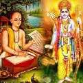

#

# | 4923 | The characters of Raamayana     |

###  Raamayana        
Raamayanais known as “ *Aadi Kaavya* ” or the first (known) poem in Sanskrit, and its

composer Valmiki, is called “ *Aadi Kavi* ” or the first poet. The Raamayana is the tale of Raama,

the prince of Ayodhya, the seventh *avataara* of Vishnu. The main purpose of this *avataara* was

the killing of Raavana and Kumbhakarna.

In later years, Goswami Tulasidas (said to be Valmiki reborn) wrote the

tradition of the Ramlila festivities observed in North India, during

Dussera culminating in the burning of huge effigies of Raavana. The

**Raamcharitmaanas** also contributed to the Bhakthi movement, owing to

the twin reasons: the commonality of language as opposed to the

exclusivity of the original work in Sanskrit, and, the projection of Raama

as a God, unlike Valmiki who portrayed Raama, as an ideal son, brother, and ruler.

*a dialect of Hindi*

## Shloka, Sarga, Kaanda

The Raamayana is divided into 7 chapters (*Kaandas*): Baala Kaanda, Ayodhya Kaanda, Aranya

Kaanda, Kishkinda Kaanda, Sundara Kaanda, Yuddha Kaanda and Uttara Kaanda.

Each *Kaanda* is divided into sections (*sargas*) which are made up of verses (*shlokas*). There are

500 *sargas* and 24000 *shlokas* in all.

Not only were the authors contemporaries of the people featured in both the epics, but they

too featured as part of the stories; Valmiki in the Raamayanaand Veda Vyaasa in the

Mahaabhaaratha!

***Raamayana, much less complex than the Mahaabhaaratha, is an eternal story, which all of  
us have heard/read umpteen times over the years. So instead of going through the story  
chronologically, you will receive nuggets of information about Gods, sages, humans, birds,  