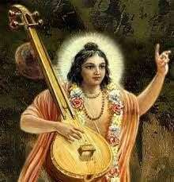
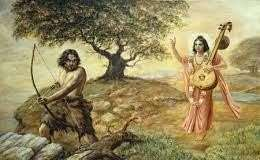

#

# | 5023 | Narada Maharishi     |

##  Rishi raja 

Narada Maharishi is the *maanasa putra* (son born of the mind) of Chaturmukha Bramha.

He is thought of as the ‘king among sages’. Narada, the eternally wandering celestial musician

and storyteller, has the ability to see the past, present and future*, and can travel across the

14 lokas. He is called the ‘cosmic messenger’, often depicted as carrying messages between

the devas and asuras, and between celestials and humans.

**trikaala gnyaani*

A highly spiritually evolved soul, Narada is forever contemplating on Hari/Narayana, and is

among the foremost devotees of the Lord. He is said to have composed the *Narada Bhakthi*

Sutra, which contains 84 short and brief formulae (*sutras*) that expound *Hari Bhakthi*.

Purandara Daasa, the most well-known among the Hari Daasas is believed to be sage Narada

reborn to popularise the *Narada Bhakthi* Sutras through his songs.

## Tamboori meetidava...

Narada is popularly depicted as carrying a musical

instrument, a  **tamburi* in his hand. Purandara Daasa has

described Narada with the song…

*Tamburi meetidava, bhavabdi daatidava, taalava*

*thattidava, surarolu seridava*

*Gejjeya kattidava, khalaredeya mettidava, gaanava*

*paadidava, Hari muruthi nodidava,*

*Vittalana nodidava, Purandara Vittalana nodidava,*

*Vaikuntakke odidava*

https://www.youtube.com/watch?v=EKNQ7WYuug0

*The one who strums a tamburi, crosses the ocean of worldly life, plays the taala, mixes with the*

*devas,*

*The one who ties anklets, and stomps on the hearts of evil people, the one who sings, the one*

*who has seen Hari,*

*The one who has seen Vittala, Purandara Vittala, the one who ran all the way to Vaikunta!*

##### *Some describe the instrument as a Veene. Narada is credited with inventing the Taanpura (Tamburi), which he

##### later developed into the Veene. The instrument that he carries is known by the name “Mahathi”. In this picture, he

##### is carrying a Veene. 

## Trouble-maker? 

Narada is unfortunately shown in popular fiction as a tattletale, causing mischief by spreading

misinformation and creating discord (*Kalaha-priya*). However, Narada is merely instrumental

in setting into motion, many of the Puranic events, acting as a catalyst. It was he who sowed

the seeds of *Bhakthi*, while Prahallada was still in his mother’s womb. A young Dhruva, on the

way to perform penance to attain Vishnu, was accosted by Narada who taught him how to go

about it and gave him the *mantra* ‘*Om namo Bhagavathe Vaasudevaaya*’.

And it was Narada, who transformed, Ratnakara the hunter, into *Aadi Kavi Valmiki*, the author of

Raamayana. Narada asked a penitent Ratnakara to perform penance, which the latter did,

unmindful of the anthill that enveloped his body. Narada thus redeemed the hunter, and once

Valmiki, as he came to be known, established an *ashrama*, he told him the story of Raama, the

ideal man, whom Valmiki was in search of to write a story.

Along with the blessings of Bramha, and Narada, Valmiki thus composed the *Aadi Kavya*, the

Raamayana.