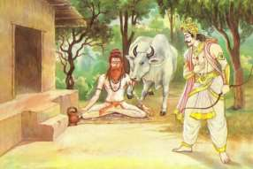
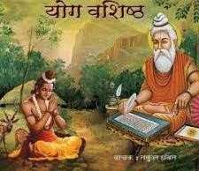

#

# | 5123 | Vasishta  |

## Vasishta, Arundhati, Kamadhenu

Maharishi Vasishta is one of the most revered rishis. Vasishta is one of the manasa-putras of

Chaturmukha Bramha and one of the seven sages known as the Sapta Rishis.  He is the

husband of Arundhati*, renowned for her chastity. He features across yugas, as there are

various stories regarding his two rebirths (as Vasishta himself). Some theories state that

“Vasishta” is not a person but a post. There are a total of 12 Vasishtas mentioned in the

*puranas*.

Arundhati finds mention in the Raamayana as she is supposed to have met Raama and Sita.

The mother of a hundred sons cursed to die at the hands of Vishwamitra, she is said to have

had two more sons who studied along with the royal princes of Ayodhya.

#### **The binary star Alcor is identified as Arundhati and Vasishta. Arundhati Nakshatra darshana (sighting the*

#### *Arundhati star) by newly married couples is a symbolic ritual to ensure a strong and successful marriage.*

## Vasishta and Vishwamitra

A popular tale that describes the rivalry between Vasishta and Vishwamitra sprang

from Vishwamitra’s desire to possess Vasishta’s wish fulfilling cow, Kaamadhenu*.

Vishwamitra, then a king called Kaushika, knew only of physical prowess and attempted

to capture Kaamadhenu by force. But, Vasishta quelled the attack by his spiritual

powers. 

##### *The names Surabhi, Nandini and Kamadhenu have been interchangeably used in different accounts

Vishwamitra, then sought to acquire spiritual powers, and performed penance to Lord

Shiva. Armed with divine weapons, he wrecked Vasishta’s hermitage and killed his hundred

sons, but Vasishta absorbed the total force of his weapons by his *Bramhadanda* (the staff

that ascetics carry). And forgave Vishwamitra, at the behest of Bramha and other Gods. A

chastened Vishwamitra went on to perform severe penance to match the spiritual powers

of Vasishta.

The rivalry finally dissolved when Vishwamitra gave up the desire to be recognised by

Vasishta as a *Bramharishi*.  Vasishta then declared that Vishwamitra had indeed become a true

*Bramharishi*!

Both the sages find mention in the Raamayana. Vasishta was the spiritual preceptor, priest

and advisor of the Ikshvaaku dynasty. It was under his advice that Dasharatha performed the

*Putrakaameshti* Yagna in order to obtain a son.

Vasishta named each of the four princes, when they were born. When Dasharatha hesitated

to send a young Raama with Vishwamitra to the forests to subdue the demons, it was

Vasishta who advised the king to honour his word and send Raama and Lakshmana with

Vishwamitra.

When Sita was struggling to don the barks before heading to the forest, Vasishta intervened

and saw to it that Sita continued to wear her jewellery and her silken clothes (unlike Raama

and Lakshmana who were dressed in barks and beads). Vasishta also declared that, Sita

should rule Ayodhya in place of the exiled Raama, and thwart Kaikeyi’s plan. Of course, Sita

refused to do so and went to the forests with Raama.

Vasishta consoled the distraught Bharatha, when Dasharatha passed away.

And he also oversaw Rama’s coronation post his return to Ayodhya, and the *Ashwamedha

yagna* performed later.

Vishwamitra trained Raama and Lakshmana for the future war to be fought against Raavana,

through the exercise of slaying demons who were hindering the performance of austerities

by various sages. He also accompanied Raama to king Janaka’s palace, enabling Raama to

redeem Ahalya on the way. At Janaka’s palace, Raama won the hand of Sita, and all the four

princes wed Sita and her sisters.

## Yoga Vasishta

Among the various scriptures composed by Vasishta, the best known is *Yoga Vasisht*, consisting of 32000 verses,

which among other names is also called **Vasisht-Raamayana**. It is a compilation of the principles taught by

Vasishta to a young Raama.

The most important concept found in this scripture says that *moksha* (salvation) is nothing but peace of mind! He

says there are four essential paths that lead to this. They are, *Kshama* (forgiveness), *Vichaara* (deliberation),

*Santosha* (joy) and *Satsang* (noble company).