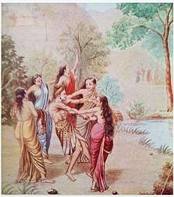
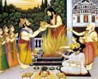

# | 5223 | Rishyashringa |

## Baala Kaanda

## The offspring of a sage and a doe

Rishyashringa was the son of sage Vibhandaka, son of Kashyapa*, and a cursed apsara** who

was in the form of a doe.

Strange tales abound about the birth of Rishyashringa, so named because he was born with a

protuberance on his head, like the antler of a deer.

On numerous occasions, Indra the king of devas and ruler of Indraloka (Swarga) feels

threatened, as anyone who performs severe austerities becomes a contender for his throne.

Indra, more often than not, uses the same trick to distract the person in question. He sends

the beauteous Urvashi or Rambha (or other apsaras ) to lead them astray.

Thus, Vibhandaka upon seeing the beautiful Urvashi, while in a river, became aroused, and his

semen mixed with water was swallowed by a doe (the cursed apsara) at the river bank. It is

said that the sage, due to his yogic powers, was capable of impregnating a female without

resorting to intercourse. Thus the doe became pregnant with a human child!

Since the doe was released from its curse following the birth of Rishyashringa, assuming the
form of an apsara she is said to have left for her heavenly abode. Vibhandaka thus bore the

sole charge of bringing up the child.

** *one of the Sapta Rishis (seven holy sages), considered as the father of devas (suras) and asuras, and many others*

*like Vaamana*

** *heavenly nymphs*

## The man who knew no women

Vibhandaka, upset that he had succumbed to the beauty of Urvashi brought up the child

in a severe environment, not exposing him to any man or woman. Thus brought up in

isolation, Rishyashringa performed austerities with unparalleled chastity*, and became a

power to be reckoned with.

**Attainment of yogic powers is in direct proportion to the level of abstinence (for non-householders).*

When the kingdom of Anga was reeling under famine, the

king Romapaada, a friend of Dasharatha’s, was told that the rain gods would bless his land

if a pure minded sage set foot in the kingdom. The king sent a

few women in Vibhandaka’s absence, to Rishyashringa. The

ascetic, at first, did not know that the women were different

from him, but once he did, he became aware of feelings

hitherto he hadn’t experienced. He craved for their company

and thus they lured him to the kingdom of Anga. And as

predicted, the moment his foot touched the ground, clouds

burst over the parched land.

## Raama’s birth

Romapada and Dasharatha, who were childhood friends, are said to have been married to

Vershini and Kausalya respectively. Vershini was Kausalya’s sister. Many accounts speak of

Shantha, the daughter of Dasharatha, the elder sister of Raama, who was given in adoption

to the childless Romapada and Vershini.

Rishyashringa is said to have married Shantha, who went on to live the life of an ascetic with

her husband. Some accounts mention that Rishyashringa married Shantha, lived in the

kingdom of Anga and after begetting a son (and giving him up to the king), and then

returned to the forest to continue his penance, along with his wife.

When Dasharatha wished to perform the putrakaameshti

yagna to beget sons, it was Rishyashringa who officiated the

yagna* and helped Dasharatha attain his desire. And thereby

became instrumental in the births of Raama, Lakshmana,

Shatrughna and Bharatha.

**upon Vasishta’s advice to Dasharatha*

