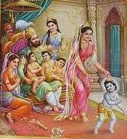
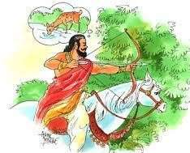

# | 5323 | Dasharatha |

## The King of Ayodhya

Nemi, the son of Aja and Indumathi, was such a skilled warrior that he could move his chariot

in ten directions, including skywards from the earth. Thus he came to be known as

“Dasharatha”. There is another fanciful explanation for the name. King Aja was childless and

Dharmaraja in the guise of a Brahmin comes to Kosala and keeps on asking Aja for alms. 

But he does not accept anything the king offers saying it does not truly belong to the king. 

Finally, Aja works at a blacksmith’s, incognito, and receives a coin for his night’s worth of

work. He gives it to the Brahmin, who throws it. The Brahmin begins to dig at the spot where

the coin falls, and he uncovers a golden chariot, which flies away to the sky. This process

goes on eight more times. After nine chariots have flown away, the tenth one emerges with

a baby, which becomes the child of Aja, Dasharatha!

Dasharatha is said to have had 350 wives (some stories say 3000!). Among the nameless

wives, his chief queens were Kausalya, Sumitra and Kaikeyi.

He worried that he had no progeny to carry on the Ikshvaaku line (male progeny, if Shantha,

his daughter, adopted by the King of Anga, is taken into account). After ruling the kingdom

for 60000* years, he was advised by Vasishta to request Rishyashringa to perform a Yagna in

order to beget a son.

The Putrakaameshti Yagna was duly performed after a magnificent Ashwamedha Yagna**.

A divine figure materialised from the fire and handed over a bowl of paayasa to Dasharatha

to give to his queen, who would then conceive. Dasharatha gave half to Kausalya, a quarter

to Sumitra an eighth to Kaikeyi. An eighth still remained

which he gave to Sumitra again. Sumitra thus bore the twins

Lakshmana (1/4th) and Shatrughna (1/8th).

The four princes born of this divine yagna were Raama,

Bharatha, Lakshmana, and Shatrughna, who were avataaras of

Vishnu, his conch (*Paanchajanya*), his bed (*Aadi Shesha*) and his

discus (*Sudarshana Chakra*), in that order. 

**this number is probably based on the exaggeration of the rule of righteous*

*kings by hundreds of years.*

*** a horse sacrifice ritual where a horse is set free to roam for a year and

*every province that it roams unchallenged becomes part of the kingdom of*

*the one who is performing the yagna.*

## Kaikeyi and the boons 

Dasharatha famed for his fighting skills often flew to the heavens and supported Indra by

fighting on his side. Once, Kaikeyi accompanying him as his charioteer rode the chariot to

safety rescuing a wounded Dasharatha, after repairing a damaged wheel, and nursed him

back to recovery. Grateful to Kaikeyi for her brave actions, Dasharatha promised her two

boons. Kaikeyi had nothing to ask for her and told him that she would use them when the

time arose.

This was forgotten by both, just as Dasharatha’s promise to Kaikeyi’s father to make her son

the king (as Kausalya had not borne a son) was forgotten.

There was no cause to recollect either of these as the four princes grew into strapping men,

loved by all, with no hint of discord, either between them or their mothers.

But when Dasharatha suddenly decided to appoint Raama as the heir to the throne, Kaikeyi,

under the influence of her nursemaid, made use of the two boons of Dasharatha, and

demanded Bharatha’s coronation as the heir and Raama’s exile to the forest for fourteen

years.

## The prophecy

Pining for Raama, Dasharatha lay lamenting when a long forgotten prophecy came to his

mind. As a young prince, Dasharatha had mastered the art of shooting arrows by the mere

direction of a sound and not by visually aiming at a target. Once, in the forest, he had heard a

sound that to him felt like that of an animal slurping water.

He shot an arrow in the direction of the sound but when the arrow

found its mark, he was aghast to hear a human cry. Rushing to the

spot, he saw a young boy who had been filling water in a pot, struck

by his arrow.

The boy, Shravana Kumara, had aged and blind parents to look

after, and was deeply saddened that they would become destitute.

Yet he forgave Dasharatha for the accident, and requested

Dasharatha to convey the news to his parents.

When Dasharatha took the pot of water to the couple and confessed to them, they were so

distraught by the loss of their son that they cursed Dasharatha that he too would endure the

same pain as theirs’ and would die of a broken heart after being separated from his beloved

son.  And indeed, the heart-broken Dasharatha died six days after Raama, Lakshmana and Sita

left for the forest.