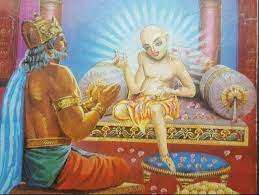
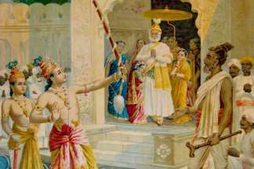

# | 5423 | Janaka |

## Janaka and Ashtaavakra

Janaka, was the ruler of Mithila, and the father of Sita.

Every Kannadiga would have heard of King Janaka, immortalised by Kuvempu, in the anthem

of Karnataka, *“Jaya Bharata Jananiya Tanujaathe…” where he says, this land that boasts of*

*rulers - the likes of Janaka… (Janakana holuva dhoregala dhaama...)*

In a history replete with stories of kings who gave up their kingdoms and pursued the path of

enlightenment, Janaka was an enlightened soul, who was coerced into running the kingdom,

despite having no interest in things worldly. Legend goes that Janaka, a spiritual aspirant,

was forever looking for ways to gain enlightenment. He is believed to have organised

debates and discussions by eminent scholars of the time.

In one such session, when everyone had their say, one young boy, with a twisted body, is

supposed to have denounced everybody’s views including his own father’s. The young boy

was Ashtaavakra*, son of Kahola. Janaka, sought to become his disciple, which Ashtaavakra

agreed to, on the condition that Janaka obeys his every command. When Janaka went to the

forests, to Ashtaavakra’s hermitage on horseback, and was about to alight, Ashtaavakra said

“Stop”. Janaka, froze mid-air, with one of his leg raised at an odd angle. There are many

versions of the duration of this awkward pause, lasting from a minute to several years.  But

the point was, this complete acceptance of Ashtaavakra’s order, the total losing of his “self”

led to sudden enlightenment. An enlightened Janaka expressed his disinterest in worldly life,

but Ashtaavakra insisted on him continuing to be a ruler.

**When Kahola, a reputed sage and disciple of sage Uddaalaka, was teaching his students, his unborn child emitted*

*a sound from his wife’s womb when Kahola made a mistake. Stung to the quick, Kahola cursed the foetus to be*

*born with a twisted body (in eight places).*

*While some stories speak of king Janaka performing a yagna, and capturing eminent sages and holding them*

*captive under water after a show of losing debates to a scholar named Bandi;  Kahola and the other sages were*

*supposed to have been rescued by a young Ashtaavakra, who defeated Bandi in debate and impressed Janaka.*

## Burning palace and missing loincloths

Janaka would efficiently carry out his duties as a king and hasten to Ashtaavakra’s hermitage.

It is said that the faces of both the guru and the king would light up, upon seeing each other.

Sadhguru Jaggi Vasudev narrates the story of how this irked the monks who felt that their

guru was compromised. One day, the discourse was disrupted by an attendant, who bowing

to Janaka, declared that the palace of Mithila was afire. Janaka rebuked him for the

interruption to the guru’s discourse and for having bowed to him, instead of, to the guru.

A few days later, someone rushed in during the discourse and announced that a troop of

monkeys had carried away the monk’s clothes from the clothesline and were throwing them

about. The monks ran to save their loincloths, only to find them hanging on the clothesline.

Ashtaavakra thus revealed the difference between themselves and Janaka, to the monks.

While Janaka bore no attachment to his riches, the monks were perturbed by the imagined

loss of their tattered clothes, and had scampered, showing disrespect to the guru and his

discourse.

## The King of Mithila**

The word “Janaka” was used as a title for the rulers of Mithila. Our King Janaka’s name was

Seeradhwaja. He was the father of Sita and Urmila, who later became the wives of Raama

and Lakshmana. His brother Kushadhwaja was the father of Mandavi and Shruthakeerthi,

who went on to wed Bharatha and Shatrughna.

Janaka is said to have ploughed land as part of a ritual, when he came across a baby, in the

furrows. Thus, Sita, was adopted by Janaka and his wife, Sunayana.

Janaka was in possession of “Pinaka”, the bow of Lord Shiva ( Shivdhanush ). The bow could

only be moved by a band of mighty warriors. Janaka laid the condition that whoever lifts and

strings the bow, will be eligible to wed Sita, for Janaka had witnessed Sita lift the bow with

ease as a mere child.

When Raama and Lakshmana reached Mithila, Vishwamitra encouraged Raama to lift the

bow. Raama, not only lifted the bow and strung it, but also broke it into two.

Thus Janaka went on to acquire Raama as his son-in-law!
