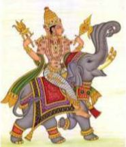
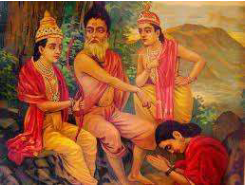

# | 5523 | Ahalya |

##  The alluring and the ascetic 
Ahalya was a woman of rare beauty having being fashioned by Bramha himself and is called 
*ayonijasambhava* (not born of a woman’s uterus). In earlier times, fathers of exceptional 
daughters, would set a task or have a contest and the one who accomplished the task/ won 
the contest would win the hand of such daughters. Once in a while, a few daughters have 
shown their preferences (as in Droupadi allegedly mocking Karna, thus spurning him).   
As seems to have been the custom, Bramha set up a contest. Whosoever circumambulated 
the world the fastest, would wed Ahalya.   
Indra took it upon himself to win the contest and claim Ahalya. But, alas, he was beaten at the 
game by the rishi Gautama*, who went around a cow in the process of giving birth, which 
amounted to the same as circumambulating the world, according to the scriptures.   
Thus, the young, beauteous Ahalya was married to the austere, older Gautama.  
  
**Gautama is a Maharishi whose name finds mention in various puranas. There are descriptions of his various* 
*marriages and children. It is not clear if they refer to the same person or not. The Gautama of this story is a* 
*maharishi, who had a son named Shatananda with Ahalya, and is credited with the creation of river Godavari, also known as Gautami, in his honour.* 

##  The trick, the curse and its redemption

Indra, besotted by Ahalya, came disguised as Gautama, after Gautama had left his hermitage 
for his morning ablutions. Some stories hint at Indra crowing as a cock to falsely herald dawn 
in order to fool Gautama. Indra, in disguise, made advances to Ahalya. There are two versions 
to Ahalya’s seduction. One that says Ahalya was truly fooled and 
another which states that she saw through the disguise but 
chose to succumb to his advances.  Anyway the deed was done, 
but even as Indra was slinking away*, Gautama arrived on the 
scene. Gautama became aware of all that had transpired, 
through his yogic powers.   
**in the form of a cat, in some accounts* 
 
Gautama cursed Indra to have his body covered by a thousand 
vulvae. Indra is often depicted in pictures as covered by a 
thousand eyes, for the vulvae turned into eyes, when he 
worshipped Surya, the Sun God.  
  
Turning to Ahalya, Gautama cursed* her to turn to stone**, to be 
redeemed in *Treta Yuga*, when Vishnu would walk on earth as 
Raama. 

Thus, Ahalya became immortalised in the Raamayana, 
regaining her human form at the mere contact with the 
dust of Raama’s feet, when Raama and Lakshmana 
were on their way to Mithila, along with Vishwamitra. 
This incident is one of the few miracles that occurs in 
Raamayana, where Raama lives and acts like a human 
being, largely.  

**Gautama’s reasoning being, there was no way Ahalya could have fallen prey to the deception (probably owing to her intelligence/yogic powers). Interestingly, the teadfastness/fidelity(mental and physical) of the wife/wives had a bearing on the strength of the husband’s yogic powers, reveal many tales. **also a dried up river, *infertile land etc. which have their own redemptions. The most popular version of Ahalya-shaapavimochana, says ‘stone’. Valmiki is said to have described Ahalya as an invisible presence, who regained her physical form when Raama approached her.*

## Pancha-kanya 

The names of five chaste wives are contemplated upon by devout women. Of the five, four are 
from the Raamayana:  
   
Ahalya (wife of Gautama)  
Sita (wife of Raama)  
Taara (wife of Vaali and later Sugreeva)  
Mandodari (wife of Raavana)  
  
The fifth is from the Mahabharatha:  
Droupadi (the wife of the Paandavas)  
  
*Ahalya Droupadi Sita Taara Mandodari tathah*  
*Panchakanya smarennityam mahaapaathaka naashanam*
  