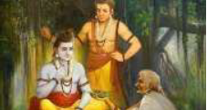
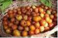
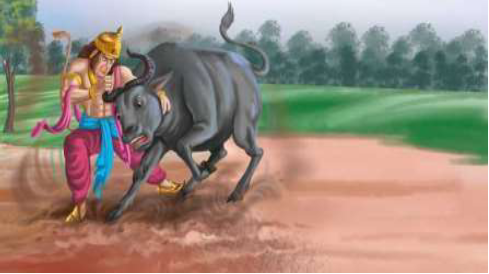

# |5623| Shabari, Matanga, Dundubhi |       

## Shabari

When Raama and Lakshmana travelled southward in search of the abducted Sita, they met 
Shabari, near present day Hampi, in the kingdom of Kishkinda, where the Vaanaras lived. 
Shabari had been patiently awaiting Raama’s visit, ever since her guru, Matanga rishi had 
asked her to.  
Not much is known about the early life of Shabari. It is said that she left her parental home 
before her wedding in disillusionment and made her way to the forests where she became a 
disciple of Matanga rishi. When the rishi gave up his body, Shabari wanted to follow suit, but 
he told her that she was destined to meet the lord in flesh and blood, when he would visit her 
hermitage in the years to come. Shabari spent every minute of the next couple of decades 
awaiting the arrival of Raama. Every chore she performed was intended as a welcome to 
Raama.  

The Raamayana describes her as an old woman who offered 
Raama fruit with bite marks. The story goes that every day 
Shabari would collect fruit (Indian Jujube/ 
ber), taste them, retain the sweet ones and 
discard the rest.  
 
 

 When Raama accepted the fruit which had been bitten into, he broke many rules*, social 
(Raama was king, a Kshatriya, and Shabari was of a low caste), and religious (one is supposed 
to offer untasted food and unsmelled flowers to the Lord).  
  
Some stories mention that Shabari suggested that Raama seek the help of Sugreeva, the 
exiled Vaanara, to find Sita. A pleased Raama granted Shabari salvation, when Shabari stoked 
*yogagni*** by her yogic powers and was consumed by the fire***.  
  
**Time and again, the Lord has demonstrated th`at he is more concerned with the thought behind the offering and* 
*not the actual offering itself. Stories of the hunter Kannappa, who offered the Shiva Linga, meat and carried water* 
*in his mouth, Aandal who wore the garlands her father strung, before they were offered to Ranganatha and so on.*   
**the fire within oneself*  
****not to be mistaken for self-immolation which amounts to suicide. These were ancient practices for giving up* 
*one’s life. Sati, wife of Shiva, when insulted at her father’s home, also resorted to this method to end her life.*
  
## Matanga rishi  
 
Matanga rishi lived in the wilderness of Kishkinda. Not much is known of him, although there 
are references to him having been born from the union of Brahmin woman and a low-born 
barber but having attained brahminhood through severe austerities. These are unclear tales, 
considering that there is a Matanga rishi who finds mention in the Mahaabhaaratha too.  

Matanga rishi, can be thought of as a learned sage who lived near the river Pampa, and had 
the divine vision to see the greatness of Shabari and accept her as a disciple, and also to 
predict Raama’s visit. The hill on which the rishi lived was called the Rishyamukha parvatha. In 
recent times, it is called Matanga hill.  
 
## Dundubhi  
  
Dundubhi was a gigantic and extremely strong person, who was invincible. He would 
transform into a colossal buffalo, in order to fight his opponents. Itching for a contest, he 
approached Varuna, the lord of the oceans and Himavaan, the lord of the mountains. Both 
refused to accept his challenge, but Himavaan suggested that he travel southward and 
challenge Vaali, the king of the Vaanaras.   
Dundubhi, therefore, challenged a reluctant Vaali to a fight.  
  

During the intense fight that 
ensued, drops of Dundubhi’s 
blood drizzled on the hermitage of  
Matanga rishi, defiling it. 
Disturbed from his deep penance, 
the rishi uttered a curse that 
whoever was responsible for this 
act was forbidden from setting 
foot on the Rishyamukha hill, for 
his head would split into pieces if 
he were to.  
  
After a fight that is said to have lasted a year, inside a cave, Vaali killed Dundubhi.   