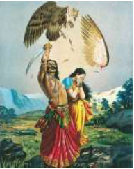

# |5723| Jatayu and Sampati |       

## Aruna, Surya’s charioteer  
  
Kadru and Vinata were sisters and two of the thirteen wives of Kashyapa. When they 

expressed their wish to have long bodied and strong bodied children each, Kashyapa granted 

them their requests. Kadru begot a 1000 eggs which hatched into snakes (*Nagas*). After 

waiting for 500 years for her two eggs to hatch, an impatient Vinata cracked open one egg.  

The body of the demi-god who emerged was formed only up to the waist. This was Aruna 

who went on to become the charioteer of Surya, the Sun-god.  

He cursed Vinata to become Kadru’s slave for the next 500 years for her impatience, after 

which the other egg cracked open and out came Garuda, the carrier of Vishnu.  
  
Aruna and Shyeni became parents to Sampati and Jatayu, who both played a helping role in 

the Raamayana, in the *Sundara kaanda* and *Aranya kaanda* respectively.  
  
## Brotherly love and burnt wings  
  
Sampati and Jatayu, were demi-gods and could change their forms at will. But they are 

typically depicted as large birds (vultures).   

They assumed non-bird forms and often visited sage Nishakara, whom they served with 

devotion, pressing his feet with their hands. Fearless and playful, assuming bird forms, they 

would vie with each other to see who could fly higher and faster. On one such occasion, 

Jatayu recklessly flew too high and Sampati, sensing that his brother’s wings may get 

scorched from the sun’s heat flew above him and spread his wings to protect Jatayu.  

But Samapti’s wings were scorched and he fell down to earth* to spend the rest of his life 

away from Jatayu.  
  
## Jatayu  
When Sita was being carried away by Raavana, in his 

*Pushpakavimana*, Jatayu, then an old bird, heard her cries for help.  
 
He rushed towards Raavana and fought as best as he could. But 

Raavana mortally wounded him and cut off his wings with his 

sword. The painter-prince, Raja Ravi Verma has frozen this scene 

forever, with his painting titled “*Jatayu vadha*”.  

The wounded and dying Jatayu was discovered by Raama and 

Lakshmana. He told them about Sita’s abduction by Raavana and 

indicated the direction (southward) that they must follow in order 

to rescue Sita.  
 

When Jatayu heard of Dasharatha’s demise, he lamented the loss of his friend. There are 

affected by drought which was said to have been caused by the malefic effect of *Shani* 

(Saturn). Dasharatha, flew his chariot towards *Shani* to request him to protect Ayodhya. 

When Shani’s gaze fell on the chariot, it was reduced to ashes, and a falling Dasharatha was 

rescued by Jatayu who was witness to the incident. Thus they became friends.  
  
As Jatayu lay drawing his last breath Raama comforted him, and granted Jatayu *moksha*, 

when his *praana* left the body. Raama who was unhappy that he could not perform his 

father’s funeral rites, drew some solace by performing the final rites of his father’s friend, 

Jatayu.  
 
## Sampati  
   
*Sampati, with his wings scorched fell to the earth. He met the rishi Nishakara and spent his 

time in gaining spiritual knowledge. The rishi taught Sampati to stop bemoaning his fate. He 

also gave him some strength and a set of tiny wings in order to wait for the next thousands 

of years, to help Raama. The rishi told Sampati that he would know that his life’s mission had 

been completed when his wings grew back.  

When the Vaanara team comprising Hanuman, Angada and others were in despair at not 

having been able to locate Sita, Sampati who lived in a cave, observed his potential prey with 

interest. Angada was most willing to let Sampati eat him up and exclaimed that it was better 

to die in service of Raama, like Jatayu, than returning to Kishkindha without news of Sita.   

Old Sampati became alert at the mention of Jatayu, his long-lost brother. Grieving at the 

news of Jatayu’s death, Sampati told the search team that Sita was in captivity in the island, 

Lanka, which lay a thousand *yojanas* beyond in the sea. He regained his wings and performed 

rites in memory of his younger brother.