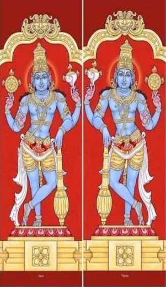
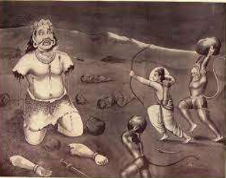

# |5923| Kumbhakarna |      

## Jaya and Vijaya

Jaya and Vijaya are the two gate-keepers (*dwaara-*
*paalakas*) of Vaikunta, the abode of Vishnu. They 
are similar to Vishnu in that they have four arms, 
bear a conch, discus and mace and are blue-hued. 
The *Bhagw*atha* tells the story of the four *maanasa* 
*putras* of Bramha, Sanaka, Sanandana, Sanaatana 
and Sanatkumara, collectively known as the 
Kumaras, who are yogis but whose physical 
appearance is that of little children. When Jaya 
and Vijaya taking the Kumaras lightly forbade 
them from entering Vaikunta, they (the Kumaras) 
wanted to rid the gate-keepers off their obscurity 
and cursed them to be born on the earth. When 
Jaya and Vijaya begged Vishnu to waive the curse, 
Vishnu partially obliged them by giving them two 
options. They could either be born seven times as 
his devotees or three times as his adversaries, 
who would be killed by Vishnu himself.  

In order to reduce the duration of their 
separation from their beloved lord, they chose 
the latter. Thus were born Hiranyaaksha and 
Hiranyakashipu, Raavana and Kumbhakarna, and 
Shishupala and Dantavakra.   
  
## Prayer gone wrong  
   
Raavana and Kumbhakarna were brothers born in *Treta yuga*.  Kumbhakarna was Vijaya 
reborn, to be killed by the *avataara* of Vishnu as Raama. Like Raavana, Kumbhakarna also 
possessed many virtues, such as piety, fearlessness, loyalty, and affection.  
He had two sons called Kumbha and Nikumbha.  
When Kumbhakarna performed severe penance and invoked Bramha, Indra, fearing that he 
may ask for his throne, requested Saraswathi to alter his prayer. Thus, Kumbhakarna is said to 
have asked for “nidrasana” (a bed for sleep) instead of “indrasana” (Indra’s throne). Bramha 
granted the wish. Upon Raavana’s intervention, Bramha clarified that Kumbhakarna would 
sleep like the dead for six months at a stretch, wake up, satisfy his enormous appetite, and 
go back to sleep. *  
**pls read this for a scientific corroboration of his symptoms, and a medical condition*
https://www.ncbi.nlm.nih.gov/pmc/articles/PMC4366788/#:~:text=Kumbhakarna%20was%20brother%20of%20th 
e, which%20was%20feared%20by%20many.  
  
## Sleeping giant  
   
As the battle between Raavana and Raama progressed and Raavana began losing most of his 
key players, Raavana decided that it was time to get the support of his powerful brother. He 
made arrangements to wake up Kumbhakarna, who is said to have been gigantic*. Cooked 
meat, aromatic food, blood and other liquids, sounds of trumpets, jabs of prods, and various 
other techniques were employed unsuccessfully. Finally, hundreds of elephants supposedly 
walked on him and successfully awakened him.   
Once awake, Kumbhakarna ate, drank and then understood the purpose of having been 
awakened. He chided Raavana for his adharmic act of keeping Sita in captivity. Knowing fully 
well that Raavana was in the wrong, he fought on his side, due to brotherly love and loyalty.  
**may have been used as a hyperbole, to indicate his strength, power and insatiable appetite.*  
  
  

He struck terror among the army of Vaanaras, 
wreaking havoc, killing thousands of Vaanaras, 
indiscriminately swallowing Vaanaras and 
Raakshasas, capturing Sugriva... When Lakshmana 
could not defeat him*, Raama, stepped forward 
and cut off his limbs. Despite this, Kumbhakarna 
continued to fight. Finally Raama, invoking the 
Indraastra, decapitated him.   
With his death, Raavana lost his confidence and 
realised that his doom was near.  
**Due to the boon/ curse, only Raama could kill him* 