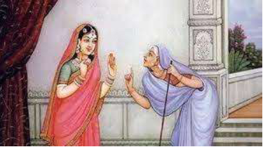
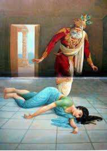

# |6023 | Manthara |      

## Nursemaid 

King Ashwapathi of Kekeya could understand the language of birds and animals but he could not 
reveal it to any other person, for he would die if he did. Once, when he was quietly chuckling to 
himself, his wife insisted on knowing why he was amused. Despite protestations, the queen was 
insistent. The king was upset that satisfying her curiosity was more important to the queen than 
her husband’s life! He banished her from his kingdom. Thus, little Kaikeyi, in the absence of her 
mother, was brought up by Manthara, her nursemaid.   
Manthara, as a mother-figure, wielded a great influence in Kaikeyi’s life as the primary female 
mother. So much so that Ashwapathi thought it befitting to send Manthara along with Kaikeyi 
post her marriage, to Ayodhya.  
When the princes were young, Kaikeyi was fonder of Raama than her own son Bharatha, but 
Manthara was always partial to Bharatha, whom she considered her own.  
A backstory talks of how Manthara was a doe in her previous birth and king Ashwapathi shot a 
deer who was her offspring’s mate. When the doe (Manthara) pleaded with the king to ease the 
deer’s pain, the king was not too bothered and the deer died. The doe (Manthara) is said to 
have vowed to make Ashwapathi, too, face the loss of his son-in-law.  
Manthara was a hunchback and is described as ugly, probably due to the deed she is infamous for. 
She is one of the most reviled characters of Raamayana.  
  
## Instigator  
  
When Manthara hurried to Kaikeyi bearing the 
news of Raama’s coronation, Kaikeyi was 
overjoyed and offered a piece of jewellery on 
her person to Manthara. Manthara then 
transformed Kaikeyi’s mind by planting doubts 
about her future status, once Kausalya became 
the Queen-mother, and of Bharatha’s, once 
Raama became the king. She coaxed Kaikeyi 
into aspiring for Bharatha’s coronation instead.  
While this has been portrayed as a cunning and malicious act in the 
Raamayana, it is also said that as a Gandharva lady in her previous 
birth, she was divinely ordained to set into motion, Raama and Sita’s 
exile, which would result in the death and destruction of demons and 
demonic forces.  

  

Thus Manthara succeeded in instigating Kaikeyi to throw a tantrum 
(with dishevelled hair and clothes, shorn of jewellery and make-up) and 
demand her long-forgotten boons from Dasharatha: coronation of  
Bharatha and exile of fourteen years for Raama.  

  
  
When Bharatha and Shatrughna came to know of Manthara’s role in the unfortunate turn of 
events, an angry Shatrughna is said to have seized her by her hair and kicked her, till Kaikeyi 
intervened and begged for her release.  
Upon his return to Ayodhya, Raama, the ideal man, readily forgave her.  
  
## The tale of the other hunchback  
  
Many thousands of years later, in Dwaapara yuga, Vishnu in the avataara of Krishna was 
accosted by a hunchback as he set foot in Mathura. Known as Kubja (literally hunchback) or as 
Trivakra (crooked in three places), she was on her way to the palace, with perfumed oils and 
sandal paste, for Kamsa, the king. But, when she saw Krishna, she fearlessly walked towards him 
and offered the oils and paste to him. Krishna, accepted the fragrant offerings and placing his 
toe on Trivakra’s foot, pulled her up by her chin. Kubja, no longer a kubja, became erect and 
beautiful. A few fanciful tales claim this hunchback to be Manthara herself! 
