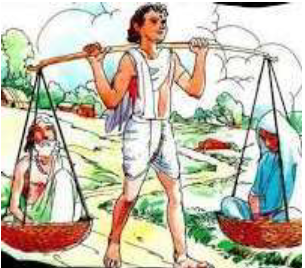

# |6123 | Shravana Kumara |      
      
## The onus  
  
The blind hermit couple Shantanu and Gyanvanti were blessed to have an affectionate and 
loving son called Shravana Kumara. There are two stories related to their loss of sight. The 
first fanciful version is that Lord Bramha blessed them with a son, but laid the condition that 
they should not look at him, ever. Both parents withheld themselves from looking at their 
baby for a month. The instant both looked at him, they lost their eyesight.  
The second more plausible version states that Shantanu was a Vaishnava, a Brahmin, who 
committed the sin of dishonouring the *varnaashrama* distinction by marrying Gyanvanti, a 
shudra. As this was frowned upon in *Treta yuga*, Aja, the king of Ayodhya and father of 
Dasharatha, is believed to have passed an order to blind them, as punishment.  
Whatever the reason may have been, young Shravana Kumara had to bear the onus of 
responsibility of looking after his aged parents. Not much is known of either Shravana 
Kumara or his parents other than the mention they find in the Raamayana.  

## Balancing baskets  
  
The name Shravana Kumara brings to mind the 
unforgettable image of a young man balancing a 
bamboo pole on his shoulder with two baskets at each 
end, carrying a blind, old woman in one, and a blind, old 
man in the other. This was the unique contraption that 
Shravana Kumara used, to transport his frail parents 
when they expressed a desire to visit holy sites.  
As they were passing through the forest abounding 

  

Ayodhya, they were thirsty and tired. Shravana Kumara 
set them down and carrying a pitcher went in search of 
the nearest source of water. His search led him a fair 
distance away from his parents. As he dunked his pitcher into the stream, the “glug, glug” of 
water getting filled in the picture was mistaken to be the sound of an animal drinking water, 
by a young Dasharatha, prince of Ayodhya.  
    
## The skill, the fatal mistake, the curse  
Dasharatha had mastered the skill of shooting an arrow towards a target based merely on the 
direction of sound. Thus he shot an arrow to kill the animal drinking water, but was horrified 
when he heard a human cry. Rushing to the spot, he discovered that his arrow had struck a 
young boy.   Shravana Kumara, realising his end was near was filled with sadness at the 
thought of leaving behind his aged parents, helpless. He forgave Dasharatha and requested 
him to carry water to them and also to let them know of everything that had taken place. 
Breathing his last, Shravana Kumara became immortal for his sense of filial duty.  
 
When a penitent Dasharatha revealed their son’s fate to the parents, they were inconsolable. 
They  refused  to  drink  the  water  he  had  gotten  for  them.  Uttering  a  dreadful  curse  that 
Dasharatha too would experience “*putra shoka*” and succumb to it like them, they gave up their 
lives. 
 